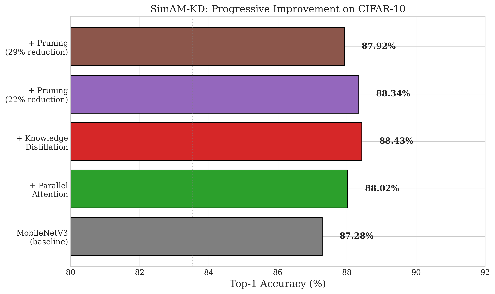

# SimAM-KD: Attention-Enhanced Knowledge Distillation for Efficient Image Classification

[](https://arxiv.org/abs/2601.XXXXX)
[](https://opensource.org/licenses/MIT)
[](https://www.python.org/downloads/)
[](https://pytorch.org/)

Official PyTorch implementation of **"SimAM-KD: Attention-Enhanced Knowledge Distillation for Efficient Image Classification"**.

<p align="center">
  
</p>

## Highlights

- **+4.49%** accuracy improvement over vanilla MobileNetV3-Small on CIFAR-10
- **88.02%** accuracy with only **1.78M** parameters
- **29%** parameter reduction through structured pruning while maintaining **87.77%** accuracy
- Generalizes to CIFAR-100 with **+4.69%** improvement

## Abstract

Deploying deep neural networks on resource-constrained edge devices remains challenging due to their high computational requirements. We propose SimAM-KD, a comprehensive framework that combines attention mechanisms, knowledge distillation, and structured pruning to create efficient yet accurate image classification models. Our approach integrates the Simple Attention Module (SimAM) and Coordinate Attention (CA) in a parallel configuration with MobileNetV3, followed by knowledge transfer from a larger teacher network and structured channel pruning.

## Installation

```bash
# Clone the repository
git clone https://github.com/adhikariraju38/SimAM-KD.git
cd SimAM-KD

# Create virtual environment (recommended)
python -m venv venv
source venv/bin/activate  # On Windows: venv\Scripts\activate

# Install dependencies
pip install -r requirements.txt
```

## Requirements

- Python >= 3.8
- PyTorch >= 2.0
- torchvision >= 0.15
- CUDA >= 11.7 (for GPU training)

## Quick Start

### Training with Knowledge Distillation

```bash
# Train with default settings (CIFAR-10, parallel attention)
python train.py --dataset cifar10 --attention parallel

# Train on CIFAR-100
python train.py --dataset cifar100 --attention parallel

# Custom temperature and alpha
python train.py --dataset cifar10 --attention parallel --temperature 4.0 --alpha 0.7
```

### Training Only Student (Without KD)

```bash
python train.py --dataset cifar10 --attention parallel --no-kd
```

### Pruning a Trained Model

```bash
python prune.py --checkpoint checkpoints/best_model.pth --pruning-ratio 0.2
```

### Evaluation

```bash
python evaluate.py --checkpoint checkpoints/best_model.pth --dataset cifar10
```

## Project Structure

```
SimAM-KD/
├── models/
│   ├── attention.py      # SimAM, CA, Parallel attention modules
│   ├── student.py        # MobileNetV3 with attention integration
│   └── teacher.py        # ResNet-50 teacher model
├── training/
│   ├── distillation.py   # Knowledge distillation trainer
│   └── pruning.py        # Structured channel pruning
├── utils/
│   ├── data_loader.py    # CIFAR-10/100 data loading
│   └── metrics.py        # Evaluation metrics
├── config/
│   └── config.yaml       # Default configuration
├── experiments/
│   ├── run_complete.py   # Full experiment suite
│   └── generate_figures.py
├── train.py              # Main training script
├── prune.py              # Pruning script
├── evaluate.py           # Evaluation script
└── requirements.txt
```

## Results

### Main Results on CIFAR-10

| Method | Accuracy (%) | Params (M) | Improvement |
|--------|-------------|------------|-------------|
| MobileNetV3-S (Baseline) | 83.53 | 1.68 | - |
| + Parallel Attention | 83.97 | 1.78 | +0.44 |
| + Knowledge Distillation | 88.02 | 1.78 | +4.49 |
| + Pruning (20%) | 87.77 | 1.27 | +4.24 |

### Attention Mechanism Comparison

| Attention Type | Accuracy (%) | Params (M) |
|----------------|-------------|------------|
| None (Baseline) | 87.28 | 1.68 |
| SimAM | 87.15 | 1.68 |
| Coordinate Attention | 87.26 | 1.78 |
| **Parallel (SimAM + CA)** | **88.02** | 1.78 |

### Ablation Studies

**Temperature Ablation:**
| T | 2.0 | 4.0 | 6.0 | 8.0 |
|---|-----|-----|-----|-----|
| Acc (%) | 85.55 | **86.07** | 84.55 | 85.50 |

**Alpha Ablation:**
| α | 0.5 | 0.7 | 0.9 |
|---|-----|-----|-----|
| Acc (%) | 85.92 | **86.17** | 86.07 |

## Usage Examples

### Using Attention Modules Standalone

```python
from models.attention import SimAM, CoordinateAttention, ParallelSimCA

# SimAM (parameter-free)
simam = SimAM(e_lambda=1e-4)
output = simam(input_tensor)  # Same shape as input

# Coordinate Attention
ca = CoordinateAttention(in_channels=64, reduction=32)
output = ca(input_tensor)

# Parallel Attention (SimAM + CA)
parallel = ParallelSimCA(in_channels=64, reduction=32)
output = parallel(input_tensor)
```

### Custom Training

```python
from models.student import MobileNetV3SimAM
from models.teacher import get_teacher_model
from training.distillation import DistillationTrainer

# Create models
student = MobileNetV3SimAM(num_classes=10, attention_type='parallel')
teacher = get_teacher_model('resnet50', num_classes=10, pretrained=True)

# Create trainer
trainer = DistillationTrainer(
    student=student,
    teacher=teacher,
    train_loader=train_loader,
    val_loader=val_loader,
    optimizer=optimizer,
    temperature=4.0,
    alpha=0.7
)

# Train
history = trainer.train(epochs=80)
```

### Applying Pruning

```python
from training.pruning import apply_structured_pruning, fine_tune_pruned_model

# Prune model
pruned_model, stats = apply_structured_pruning(
    model=trained_model,
    pruning_ratio=0.2,
    example_input=torch.randn(1, 3, 32, 32)
)

# Fine-tune
fine_tune_pruned_model(pruned_model, train_loader, val_loader, epochs=30)
```

## Citation

If you find this work useful, please cite our paper:

```bibtex
@article{yadav2026simamkd,
  title={SimAM-KD: Attention-Enhanced Knowledge Distillation for Efficient Image Classification},
  author={Yadav, Raju Kumar and Khanal, Rajesh and Yadav, Safalta Kumari and Shah, Rikesh Kumar and Gupta, Bibek Kumar},
  journal={arXiv preprint arXiv:2601.XXXXX},
  year={2026}
}
```

## Acknowledgments

- [SimAM](https://github.com/ZjjConan/SimAM) - Simple Attention Module
- [Coordinate Attention](https://github.com/houqb/CoordAttention) - Coordinate Attention
- [torch-pruning](https://github.com/VainF/Torch-Pruning) - Structured Pruning

## License

This project is licensed under the MIT License - see the [LICENSE](LICENSE) file for details.

## Contact

- **Raju Kumar Yadav** - [076bct100.raju@pcampus.edu.np](mailto:076bct100.raju@pcampus.edu.np) - IOE, Pulchowk Campus
- **Rajesh Khanal** - [076bct099.rajesh@pcampus.edu.np](mailto:076bct099.rajesh@pcampus.edu.np) - IOE, Pulchowk Campus
- **Safalta Kumari Yadav** - [076bag034@ioepc.edu.np](mailto:076bag034@ioepc.edu.np) - IOE, Purwanchal Campus, Dharan
- **Rikesh Kumar Shah** - [076bct067@ioepc.edu.np](mailto:076bct067@ioepc.edu.np) - IOE, Purwanchal Campus, Dharan
- **Bibek Kumar Gupta** - [bibek.191314@ncit.edu.np](mailto:bibek.191314@ncit.edu.np) - Nepal College of Information Technology

---

<p align="center">
  <b>If you find this work useful, please consider giving it a star!</b>
</p>
